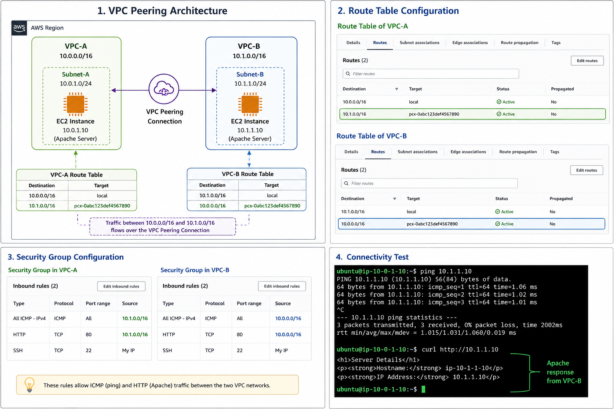

# AWS VPC Peering Connection with EC2 Apache Web Servers

## Project Description

This project demonstrates the implementation of an **AWS VPC Peering Connection** between two isolated Virtual Private Clouds (VPCs).

The objective is to establish secure private communication between EC2 instances running in separate VPC networks using AWS private IP addresses, without routing traffic through the public internet.

The project includes:

* Creating two AWS VPCs with non-overlapping CIDR ranges
* Creating subnets inside each VPC
* Deploying EC2 instances in separate VPCs
* Configuring Apache web servers using EC2 User Data
* Establishing a VPC Peering Connection
* Updating AWS Route Tables for private communication
* Configuring AWS Security Groups for ICMP and HTTP traffic
* Testing connectivity using `ping` and `curl`

---

## Architecture Overview

```text
                     AWS Region

    +--------------------------------+
    |             VPC-A              |
    |          10.0.0.0/16           |
    |                                |
    |        EC2 Instance            |
    |        10.0.1.x                |
    |                                |
    |        Apache Server           |
    +---------------+----------------+
                    |
                    |
          VPC Peering Connection
                    |
                    |
    +---------------+----------------+
    |             VPC-B              |
    |          10.1.0.0/16           |
    |                                |
    |        EC2 Instance            |
    |        10.1.1.x                |
    |                                |
    |        Apache Server           |
    +--------------------------------+



```

---

## Technologies Used

| Technology | Purpose |
| --- | --- |
| **AWS VPC** | Network isolation |
| **AWS VPC Peering** | Private communication between VPCs |
| **EC2** | Compute instances |
| **Apache2** | Web server deployment |
| **AWS Security Groups** | Network access control |
| **Route Tables** | Traffic routing |
| **Linux Bash Script** | EC2 automation |

---

## Project Requirements

Before starting, ensure you have:

* An active AWS Account
* IAM permissions for:
* VPC creation
* EC2 deployment
* AWS Security Group modification
* Route Table updates


* Two VPC CIDR ranges that do not overlap

---

## Environment Configuration

| Resource | Configuration |
| --- | --- |
| **VPC-A** | `10.0.0.0/16` |
| **VPC-B** | `10.1.0.0/16` |
| **Subnet-A** | `10.0.1.0/24` |
| **Subnet-B** | `10.1.1.0/24` |
| **Region** | Same AWS Region |

---

## Implementation Steps

### 1. Create VPCs

Create two VPCs ensuring the CIDR ranges strictly do not overlap.

* **VPC-A:** Name `VPC-A` | CIDR `10.0.0.0/16`
* **VPC-B:** Name `VPC-B` | CIDR `10.1.0.0/16`

### 2. Create Subnets

Create subnets inside each corresponding VPC.

* **Subnet-A:** VPC `VPC-A` | CIDR `10.0.1.0/24`
* **Subnet-B:** VPC `VPC-B` | CIDR `10.1.1.0/24`

### 3. Launch EC2 Instances & User Data Configuration

Deploy two Ubuntu EC2 instances.

* **Instance-1:** VPC `VPC-A` | Subnet `Subnet-A`
* **Instance-2:** VPC `VPC-B` | Subnet `Subnet-B`

**EC2 User Data:**
During EC2 creation, navigate to **Advanced Details** > **User Data** and add the following bash script to both instances. This automatically installs Apache, creates a custom web page, and displays the hostname and private IP address.

```bash
#!/bin/bash

apt update -y
apt install apache2 -y

echo "<h1>Server Details</h1>
<p><strong>Hostname:</strong> $(hostname)</p>
<p><strong>IP Address:</strong> $(hostname -I | awk '{print $1}')</p>" \
> /var/www/html/index.html

systemctl restart apache2

```

### 4. Create VPC Peering Connection

1. Navigate to **AWS Console** > **VPC** > **Peering Connections** > **Create Peering Connection**.
2. **Name:** `VPC-A-to-VPC-B`
3. **Requester:** `VPC-A`
4. **Accepter:** `VPC-B`
5. Click Create.

### 5. Accept Peering Request

1. Navigate to **VPC** > **Peering Connections**.
2. Select the pending request.
3. Click **Actions** > **Accept Request**.
4. Verify the Status changes to **Active**.

### 6. Configure AWS Route Tables

VPC Peering does not automatically add routes. Manual route configuration is required to map the peering connection.

* **VPC-A Route Table:** * Add Route -> Destination: `10.1.0.0/16` | Target: `VPC Peering Connection`
* **VPC-B Route Table:** * Add Route -> Destination: `10.0.0.0/16` | Target: `VPC Peering Connection`

### 7. Configure AWS Security Groups

Allow private communication between the instances.

* **VPC-A AWS Security Group:**
* **Inbound:** ICMP IPv4 | Source: `10.1.0.0/16`
* **Inbound:** HTTP (Port 80) | Source: `10.1.0.0/16`


* **VPC-B AWS Security Group:**
* **Inbound:** ICMP IPv4 | Source: `10.0.0.0/16`
* **Inbound:** HTTP (Port 80) | Source: `10.0.0.0/16`


---

## Testing Connectivity

To validate the deployment, connect to the EC2 instance in VPC-A via SSH:

```bash
ssh -i key.pem ubuntu@<vpc-a-public-ip>

```

### Network Diagnostic Commands

**1. Test ICMP Routing:**

```bash
ping <VPC-B-private-ip>
# Example: ping 10.1.1.25

```

*Expected Output:* `64 bytes from 10.1.1.25...`

**2. Test Application Layer (HTTP):**

```bash
curl http://<VPC-B-private-ip>
# Example: curl http://10.1.1.25

```

*Expected Output:*

```html
<h1>Server Details</h1>
<p><strong>Hostname:</strong> ip-10-1-1-25</p>
<p><strong>IP Address:</strong> 10.1.1.25</p>

```

---

## Troubleshooting & Service Management

| Issue | Resolution |
| --- | --- |
| **Ping timeout** | Check AWS Security Group ICMP inbound rules on both instances. |
| **Curl fails** | Verify the Apache service status using the service management commands below. |
| **Host unreachable** | Check Route Tables to ensure the `pcx-` target is correctly mapped to the opposing CIDR. |
| **Peering inactive** | Ensure the peering request was explicitly accepted in the Accepter VPC. |
| **CIDR overlap error** | VPC Peering requires strictly isolated CIDR ranges; recreate VPCs with different networks. |

### Service Management Commands (Local Instance)

If Apache fails to respond, SSH into the target instance and execute:

```bash
# Check Apache Service Status
sudo systemctl status apache2

# Restart Apache Service
sudo systemctl restart apache2

```

---

## Cleanup Resources

To avoid unnecessary AWS charges, ensure you delete the following resources when testing is complete:

1. EC2 instances
2. VPC Peering Connection
3. Subnets
4. Route Tables
5. VPCs

---

## Learning Outcomes

After completing this project, you will understand:

* AWS VPC networking and isolation.
* Establishing private communication between VPCs using Peering Connections.
* Route table management for cross-VPC traffic.
* AWS Security Group configurations for specific protocols (ICMP/HTTP).
* EC2 infrastructure bootstrapping using User Data scripts.
* Basic networking troubleshooting methodologies.
